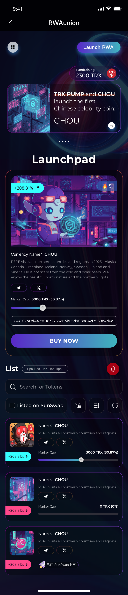

1.RWAUnion移动应用UI界面参考图
2.页面整体为移动端竖屏布局，适配设备为智能手机，屏幕宽375px，高812px，背景为深紫色渐变，带有蓝色光晕效果。

顶部状态栏显示时间"9:41"，居左；右侧依次为信号图标、WiFi图标、电池图标，均为白色。状态栏下方为导航栏，左侧有白色返回箭头图标，中间为白色"RWAUnion"文字，右侧为紫色背景蓝色文字的"Launch RWA"按钮，按钮尺寸为120px×36px，文字为14px白色粗体。

导航栏下方右侧有悬浮信息框，背景为深紫色半透明，内含"Fundraising"白色小字，"2300 TRX"白色粗体文字，右侧配有红色TRX图标，整体尺寸80px×24px。

中部轮播区域背景为深蓝色渐变，包含左侧科技感城市夜景图片（宽150px，高100px），右侧文字"TRX PUMP and CHOU launch the first Chinese celebrity coin: CHOU"，白色粗体，文字尺寸16px，行高22px。轮播图下方有三个灰色圆点指示器，当前页圆点为白色。

"Launchpad"标题位于轮播图下方，白色粗体，字号24px，居中显示，底部有16px留白。

主项目卡片背景为深紫色带橙色边框，尺寸343px×300px，内有顶部绿色标签"+208.81%"配向上箭头，右侧火焰图标带数字"5"。卡片中部为卡通人物插画（宽300px，高180px），下方文字"Currency Name: CHOU"白色16px，描述文字"PEPE visits all northern countries and regions in 2025 - Alaska, Canada, Greenland, Iceland, Norway, Sweden, Finland and Siberia. He is not scare from the cold and polar bears. PEPE enjoys the beautiful north nature and the northern lights."白色12px，行高16px。卡片底部左侧有分享图标和关闭图标，均为白色圆形按钮（24px×24px），右侧显示"Marker Cap: 3000 TRX (30.87%)"，进度条为紫色填充（占比30.87%），灰色背景，长度280px，高4px。CA地址"0xbDd4A37C18327652BbbF6d9088A2f3969e4d6e1"为灰色10px文字，位于进度条下方。底部"BUY NOW"按钮为蓝紫渐变背景，白色文字16px粗体，尺寸310px×44px，圆角22px。

"List"标题为白色18px粗体，居左，右侧有红色铃铛图标（24px×24px）。标题下方有灰色"Tips Tips Tips Tips Tips"标签，背景浅灰，文字12px。搜索框为深灰色背景，左侧白色放大镜图标，提示文字"Search for Tokens"灰色14px，尺寸343px×40px，圆角8px。

筛选栏包含"Listed on SunSwap"复选框（白色框体，未选中），右侧三个图标：筛选、列表、刷新，均为白色24px×24px，间隔16px。

列表项共3个，每个高度120px，背景深紫色带橙色边框，间距12px。第一项左侧图标为红色机器人插画（60px×60px），右侧文字"Name: CHOU"白色16px，描述同主卡片，灰色12px，底部显示"+208.81%"绿色文字配向上箭头，"Marker Cap: 3000 TRX (30.87%)"灰色12px，进度条同主卡片。第二、三项结构相同，图标分别为蓝色科技感图案和粉色LOGO，第三项底部有"已在 SunSwap上市"标签，背景浅紫，文字12px白色，配火箭图标。

所有文字使用无衬线字体，按钮和重要信息使用粗体，数字和百分比使用高亮颜色，整体风格为赛博朋克风，元素有发光效果和渐变边框。